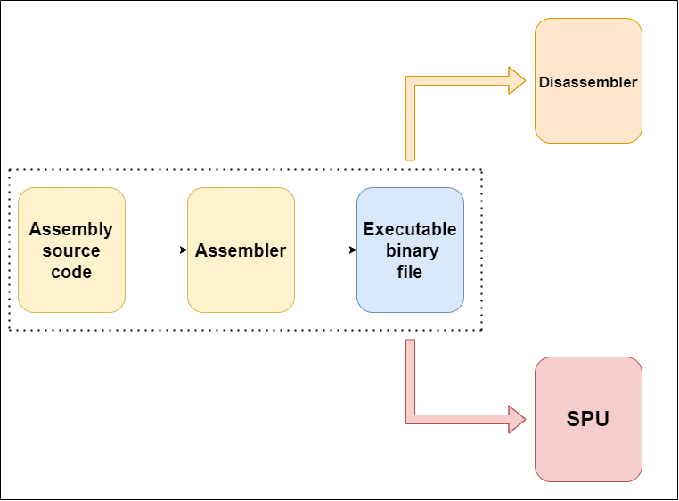
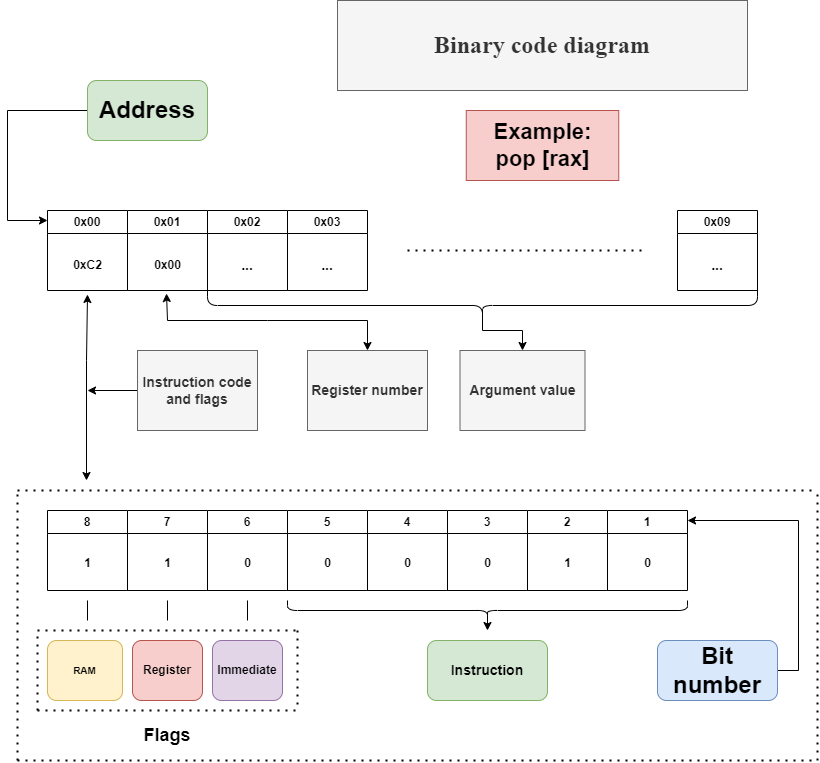

## Introduction 
This project is dedicated to creating my own simplified virtual machine that simulates the work of a single processor unit. The project is split into three seperate programs: an assembler, a disassembler, and the machine itself. Here you can see a visualization of the units:




## Assembler

The assembler translates my assembly language code into my virtual machine's binary code. Let me describe syntax rules:

1. Empty lines are allowed.

2. Single-line comments can be made using the '**;**' char (**be careful** with names starting with **inf** and **nan**).

```

push rax ; push value from register rax

```

3. Label names end with a '**:**'.

```

main:    ; correct label name

```
4. List of all commands:

**PUSH**:
```
push            <- put to the value stack

push 1          <- number

push rax        <- number from register

push [1]        <- value from RAM cell 1

push [rax]      <- number from the cell with the number stored in rax in RAM

push [rax + 1]  <- number from the cell with the number stored in rax + 1 in RAM

```

Same syntax can be applied to **POP**:

```
pop           <-  pop value from value stack

```
commands without arguments:

```
in            <- input number

out           <- output the top number from the stack

hlt           <- stop program

add           <- sum of the top two numbers

sub           <- difference of the top two numbers

mul           <- multiplication of the top two numbers

div           <- division of the top two numbers

sqrt          <- square root of a number

sin           <- sine of a number

cos           <- cosine of a number

rnd           <- round number
 
```
**Jump** commands (two types: conditional and unconditional):

Unconditional:

```
jmp           <- jump to certain label

call          <- jump, the return address is pushed onto the call stack

ret           <- return jump to the address at the top of the call stack 

```

Conditional:

```

ja            <- jump if x > y 

jae           <- jump if x >= y 

jb            <- jump if x < y 

jbe           <- jump if x <= y 

je            <- jump if x == y 

jne           <- jump if x != y 


```

Other commands:

```

meow          <- print "meow :3"          

scrn          <- dump video memory 

```

<details>
  <summary> Full list of instructions with their hex value </summary>

| Instruction name | Hex represantation |
|------------------|--------------------|
| PUSH             | 0x01               |
| POP              | 0x02               |
| IN               | 0x03               |
| ADD              | 0x04               |
| SUB              | 0x05               |
| MUL              | 0x06               |
| DIV              | 0x07               |
| SQRT             | 0x08               |
| SIN              | 0x09               |
| COS              | 0x0A               |
| OUT              | 0x0B               |
| HLT              | 0x0C               |
| JMP              | 0x0D               |
| JNE              | 0x0E               |
| JE               | 0x0F               |
| JBE              | 0x10               |
| JB               | 0x11               |
| JAE              | 0x12               |
| JA               | 0x13               |
| CALL             | 0x14               |
| RET              | 0x15               |
| MEOW             | 0x16               |
| RND              | 0x17               |
| SCRN             | 0x18               |

</details>

## SPU

Executes code byte by byte. Variable length bytecode. The processor first reads the command byte and information about whether there is a register reference, memory access, value is masked in that same byte. 

Two stacks are used: 1st for calculations and 2nd for calls. This decision was made due to shortage of time during the semester (at least that's what I remember). You can look at my stack implementation here: [stack repo](https://github.com/aidenfmunro/Stack). 

RAM, stack & registers are all double value based. Meaning 8 bytes for immediate value is used.

How does the bytecode work:



---

I also want to point out the unified command system in the assembler, machine, and disassembler. All commands are presented in a single format. Note that the code in these three programs is the same, so the decision was made to use code generation with #include.

What does this look like? In the [commands.h](headers/commands.h) file:

```

DEF_COMMAND(name, num, argc, code)

name          <- command name

num           <- command number

argc          <- argument presence (0 or 1)

code          <- command code

```

## Disassembler (WIP)

Converts bytecode into a file with commands and arguments. Currently the program is broken, fixes will be done.

## Build

```

make dirs

make

./main input_file.txt input_file_listing.txt input_file.bin

```

## System specs

CPU: AMD Ryzen 7 5800HS with Radeon Graphics, 3201 Mhz, 8 Core(s), 16 Logical Processor(s)

RAM: 16.0 GB

OS: Ubuntu 22.04 (WSL)

Compiler: g++ 11.4.0


